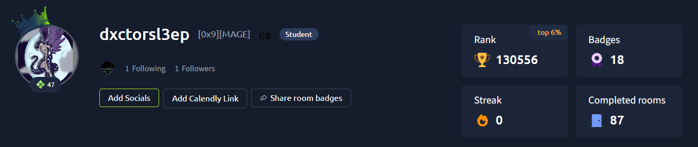

<div align="center">

# root@Mathias:~$ whoami

`SOC analyst path | System & Network background | Blue Team mindset`

Un profil axe sur la securite defensive et l'analyse de logs.


</div>

---

## Live Profile Snapshot

```console
Mathias@github:~$ ./display_profile.sh
[INFO] LOADING USER PROFILE...
[ OK ] INITIALIZING MONITORING STACK...
[ OK ] ROLE: Future SOC Analyst (Alternance target - Aug 2026)
[ OK ] LEVEL: Bachelor 3 Informatique @ EPSI
[ OK ] BACKGROUND: System and Network Administration
[ OK ] FOCUS: Defensive Security, Hardening, Log Analysis
[ OK ] TELEMETRY: Sysmon, Windows Event Logs, Linux auth.log
[ OK ] STATUS: READY FOR INCIDENT TRIAGE

Mathias@github:~$ cat stack_check.log
> Languages      : Python, C, C#, JavaScript, SQL, Bash
> Frameworks     : Django
> Infrastructure : Proxmox, OPNsense, TCP/IP, VLAN
> Security       : TryHackMe, SOC analysis, pentest fundamentals
```

---

## Certification Log

<div align="center">
  
</div>

---

## System Modules


---

## Objectifs actuels

- Renforcer mes scripts d'automatisation SOC (Python + PowerShell)
- Ameliorer mon flux de detection et ma vitesse de triage
- Continuer a progresser sur des laboratoires pratiques et des scenarios d'incident reels

---

## Contact

- LinkedIn: [Mathias De Meuleneire](https://www.linkedin.com/in/mathias-de-meuleneire-2788b7333/)
- TryHackMe: [dxctorsl3ep](https://tryhackme.com/p/dxctorsl3ep)
- GitHub: you are here (Dxctor-Sl3ep)

